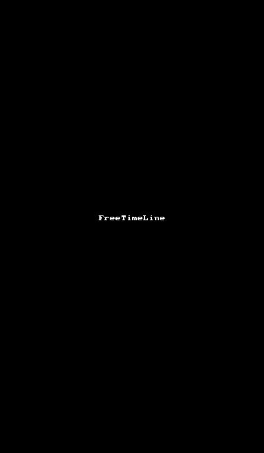

  
# FreeTimeLine
*美观灵活强大的时间轴组件.* 

[示例apk](demo.apk)



### Android Studio:  

`compile 'com.chenenyu.freetimeline:ftl:2.1'`

### Eclipse:  
呵呵...  

## Avaliable attrs:
* ------v1.0------
* top_type  第一个结点的样式
* node_type  中间节点的样式
* bottom_type  最后一个结点的样式
* line_color  轴线颜色
* solid_color  实心圆颜色
* hollow_color  空心圆颜色
* sucker_color  吸盘的样色
* toggle_color  折叠按钮的颜色
* ------v2.1------
* left_color  左侧文本的颜色
* left_size  左侧文本的大小
* parent_color  中间标题文本的颜色
* parent_size  中间标题文本的大小
* child_color  中间副文本的颜色
* child_size  中间副文本的大小
* show_toggle  是否展示折叠按钮

上述所有属性都可在xml或者代码中配置


***其他的自定义属性将会陆续的添加进来!***

## 使用：
xml中:  

	<com.chenenyu.freetimeline.FreeTimeLine  
		android:id="@+id/ftl"  
		android:layout_width="match_parent"  
		android:layout_height="wrap_content"  
        ftl:bottom_type="solid"  
        ftl:child_color="#60615d"  
        ftl:node_type="hollow"  
        ftl:parent_color="#5b4d0e"  
        ftl:solid_color="#c65e4a"  
        ftl:show_toggle="true"  
        ftl:sucker_color="#FF4EAAB2"  
        ftl:toggle_color="#4e85b2"  
        ftl:top_type="sucker"/>  

然后设置内容元素:  

`ftl.setElements(List<FreeTimeLineElement>);`  

同样可以在代码中改变配置:

`ftl.setConfig(FreeTimeLineConfig);`


**欢迎提交代码、bug和讨论 : )**

## License

请确保你已知晓该[开源协议](http://www.apache.org/licenses/LICENSE-2.0)! 

```
Copyright 2016 chenenyu.

Licensed under the Apache License, Version 2.0 (the "License");
you may not use this file except in compliance with the License.
You may obtain a copy of the License at

   http://www.apache.org/licenses/LICENSE-2.0

Unless required by applicable law or agreed to in writing, software
distributed under the License is distributed on an "AS IS" BASIS,
WITHOUT WARRANTIES OR CONDITIONS OF ANY KIND, either express or implied.
See the License for the specific language governing permissions and
limitations under the License.
```